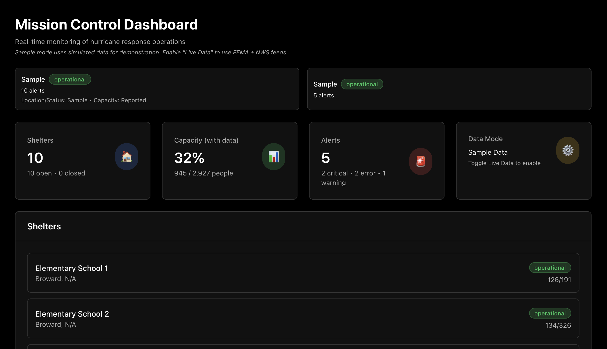

# ReliefOps

A real-time hurricane response monitoring console for disaster relief operations. ReliefOps aggregates live data from public sources (FEMA Open Shelters and National Weather Service alerts) to provide emergency managers with a unified view of shelter status, weather threats, and incident workflows.



## Features

### 🎯 Real-Time Data Integration
- **FEMA Open Shelters**: Live shelter locations, status, and availability from FEMA's ArcGIS service
- **NWS Alerts**: Real-time weather alerts from the National Weather Service API
- **Unified Live Data Toggle**: Single control to enable/disable both data sources simultaneously
- **Data Provenance**: Clear indicators showing data source, last fetch time, and field coverage

### 📊 Mission Control Dashboard
- **Overview Dashboard**: Real-time metrics, clickable cards, and "Top Changes" activity feed
- **Shelters Management**: Comprehensive shelter list with filtering, search, and detailed drill-down pages
- **Alerts System**: Explainable alerts with Signal → Evidence → Impact → Suggested Actions
- **Incident Workflow**: Create incidents from alerts, assign team members, execute runbooks, and maintain audit trails

### 🎨 Enterprise-Grade UI
- **Dark Theme**: Palantir-style dark theme with true black backgrounds and high contrast
- **Smooth Transitions**: Apple-like animations with accessibility support (`prefers-reduced-motion`)
- **Responsive Design**: Works seamlessly on desktop and tablet devices
- **Data Trust Indicators**: Clear labeling of live vs. sample data, with explicit N/A handling for unavailable fields

### 🔄 Workflow Management
- **Incident Creation**: Convert NWS alerts into trackable incidents
- **Runbook Checklists**: Step-by-step response procedures with status tracking
- **Notes & Collaboration**: Add notes and maintain conversation threads
- **Audit Trail**: Complete history of all actions with timestamps and actors

## Tech Stack

- **Frontend**: React 18 + TypeScript
- **Build Tool**: Vite
- **Styling**: Tailwind CSS with CSS variables for theming
- **State Management**: Zustand
- **Routing**: React Router v6
- **Animations**: Framer Motion
- **Data Fetching**: Native Fetch API with polling
- **Date Handling**: date-fns

## Getting Started

### Prerequisites

- Node.js 18+ and npm

### Installation

1. Clone the repository:
```bash
git clone https://github.com/pgvaghela/ReliefOps.git
cd ReliefOps
```

2. Install dependencies:
```bash
npm install
```

3. Start the development server:
```bash
npm run dev
```

4. Open your browser to `http://localhost:5173`

### Building for Production

```bash
npm run build
```

The production build will be in the `dist` directory.

## Usage

### Live Data Mode

1. Enable "Live Data" toggle in the top navigation
2. Select a state from the dropdown (FL, TX, LA, NC, SC, GA, AL, MS)
3. The app will automatically fetch:
   - FEMA shelters every 10 minutes
   - NWS alerts every 2 minutes

### Sample Data Mode

When "Live Data" is disabled:
- Sample shelters and alerts are displayed for demonstration
- A red rolling disclaimer ribbon appears at the top
- No API calls are made

### Creating Incidents

1. Navigate to the Overview or Alerts page
2. Click on an NWS alert (in Live Data mode)
3. Click "Create Incident" in the alert drawer
4. The incident will include:
   - Pre-configured runbook steps
   - Link to the source alert
   - Audit trail for all actions

## Data Sources

### FEMA Open Shelters
- **Endpoint**: FEMA ArcGIS Feature Layer
- **Poll Interval**: 10 minutes
- **Available Data**: Location, status, address, city, state
- **Unavailable Data**: Capacity, occupancy, supplies, intake rates

### National Weather Service
- **Endpoint**: `api.weather.gov/alerts/active/area/{STATE}`
- **Poll Interval**: 2 minutes
- **Available Data**: Event type, severity, urgency, area description, timestamps

## Project Structure

```
ReliefOps/
├── src/
│   ├── components/        # React components
│   │   ├── ui/           # Base UI components (Card, Button, etc.)
│   │   └── layout/       # Layout components (TopNav, SideNav)
│   ├── routes/           # Page components
│   ├── store/            # Zustand state management
│   ├── integrations/     # External API integrations
│   ├── types/            # TypeScript type definitions
│   ├── utils/            # Utility functions
│   └── styles/           # Global styles and theme
├── public/
│   └── screenshots/      # Screenshots for case study
└── package.json
```

## Key Features Explained

### Data Trust Model

ReliefOps is transparent about data availability:
- **Live Data**: Clearly labeled with source badges showing last fetch time
- **Sample Data**: Prominent disclaimer when using mock data
- **N/A Fields**: Unavailable data is explicitly marked as "N/A" with explanations
- **Coverage Indicators**: Each data source shows what fields are available

### Incident Workflow

1. **Detect**: Alerts appear in real-time from NWS
2. **Triage**: Alert drawer explains Signal → Evidence → Impact
3. **Diagnose**: Shelter detail pages show available data
4. **Act**: Create incidents, assign, execute runbooks
5. **Audit**: Every action is logged with timestamp and actor

## Configuration

Edit `src/config.ts` to adjust:
- Poll intervals for NWS and FEMA
- Default state selection
- Feature flags

## Browser Support

- Chrome/Edge (latest)
- Firefox (latest)
- Safari (latest)

## Contributing

This is a portfolio project. For questions or feedback, please open an issue.

## License

This project is for portfolio/demonstration purposes.

## Acknowledgments

- **FEMA**: For providing the Open Shelters API
- **National Weather Service**: For the public weather alerts API
- Built with modern web technologies for optimal performance and developer experience

---

**Note**: This application uses public APIs and is designed for demonstration purposes. Some operational metrics (occupancy, supplies, intake rates) are not available from public sources and are shown as N/A when in live mode.
